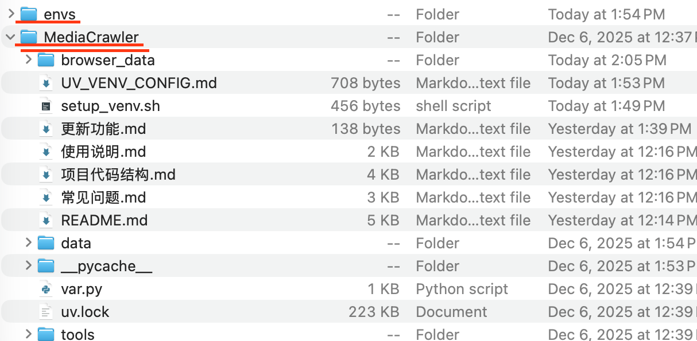

# 本地原生环境管理

## 推荐方案：使用 uv 管理依赖

### 1. 前置依赖
- 安装 [uv](https://docs.astral.sh/uv/getting-started/installation)，并使用 `uv --version` 验证。
- Python 版本建议使用 **3.11**（当前依赖基于该版本构建）。
- 安装 Node.js（抖音、知乎等平台需要），版本需 `>= 16.0.0`,node -v
验证。

### 2. 同步 Python 依赖
#### uv 虚拟环境路径配置说明

uv 使用环境变量 `UV_PROJECT_ENVIRONMENT` 来指定虚拟环境的路径。

## 使用提供的脚本（推荐）

```bash
# 进入项目根目录
cd MediaCrawler
# 在项目根目录下执行
source setup_venv.sh

```
## 路径说明

- **相对路径**：如 `../envs/MediaCrawler`，相对于项目根目录解析
- **绝对路径**：如 `/Users/{your_nanme}/envs/MediaCrawler`，直接使用该路径

## 注意事项

1. 如果指定的路径不存在，uv 会自动创建
2. 设置环境变量后，运行 `uv sync` 会在指定路径创建虚拟环境,***后续更新时请将软件包放到原有目录下***

```shell
# 使用 uv 保证 Python 版本和依赖一致性
uv sync
```

### 3. 安装 Playwright 浏览器驱动
```shell
uv run playwright install
```
> 项目已支持使用 Playwright 连接本地 Chrome。如需使用 CDP 方式，可在 `config/base_config.py` 中调整 `xhs` 和 `dy` 的相关配置。

### 4. 运行爬虫程序
```shell
# 请在 config/base_config.py 中修改爬虫设置
# 其他功能开关也可在 config/base_config.py 查看，均有中文注释
source setup_venv.sh #每次使用软件前需运行一次
# （推荐）安装baseconfig中的设置进行爬取
uv run main.py
# 从配置中读取关键词搜索并爬取帖子与评论
uv run main.py --platform xhs --lt qrcode --type search

# 从配置中读取指定帖子ID列表并爬取帖子与评论
uv run main.py --platform xhs --lt qrcode --type detail

# 其他平台示例
uv run main.py --help
```


环境文件envs与代码文件mediacrawler应在同一目录下，后续更新将代码文件更新即可